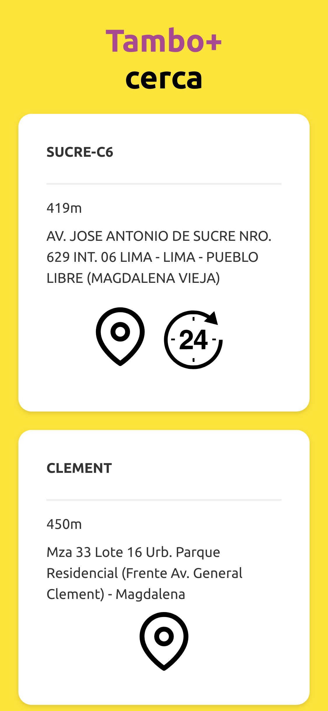

# React-Tambo

  <h2>A nextjs app + api endpoint that shows the nearest tambo+ stores</h2>
  

## Client

Just go to the index `/` to get the nearest stores first

## Endpoints

Theres only `/nearest` that accepts the params `currentLatitude` and `currentLongitude`